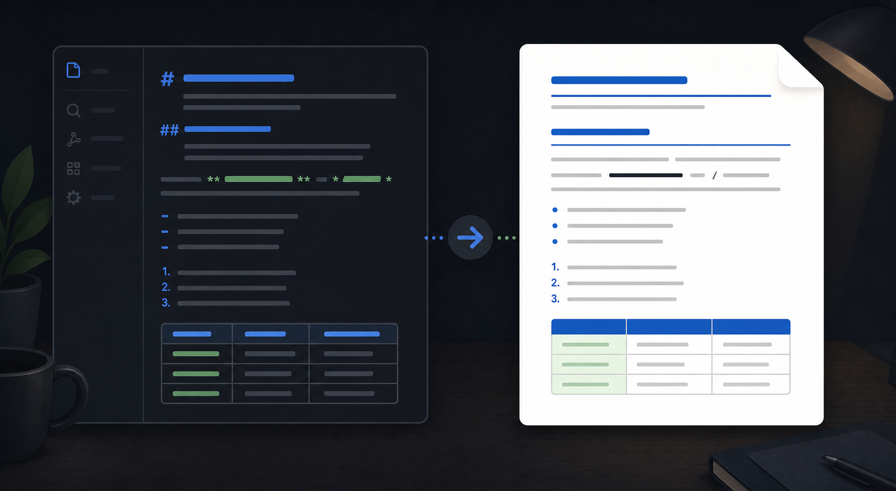

# Export Selection to Word (RTF)

Export the current Markdown selection—or the whole note when no text is selected—to a Word-readable Rich Text Format (RTF) file. The plugin converts common Markdown structure into portable document formatting without external tools.

> The image is an illustrative example of the workflow, not a screenshot of the plugin.

## Features

- Exports the current selection or the entire active Markdown note.
- Preserves headings, bold, italics, underline, strikethrough, inline code, lists, and tables.
- Optionally strips Markdown links, wikilinks, and visible URLs.
- Lets you choose whether to keep inline formatting.
- Writes beside the source note by default, or into a vault folder you specify.
- Provides controls for list indentation and table width.

## Install

1. Copy this folder to <vault>/.obsidian/plugins/selection-to-word-rtf/.
2. Open Settings → Community plugins.
3. Enable **Export Selection to Word (RTF)**.

The included main.js is prebuilt. This plugin is desktop-only because it writes a local RTF file through Obsidian's adapter.

## Usage

1. Open a Markdown note.
2. Select the passage to export, or leave the selection empty to export the whole note.
3. Open Command Palette and run **Export selection to Word (RTF)…**.
4. Choose the export options and click **Export**.
5. Open the generated Note name (export).rtf in Word or another RTF-compatible editor.

By default the file is created in the source note's folder. Set **Export folder** to a vault-relative folder such as Exports.

## Limitations

- RTF is a compatibility format, not a full Word document model.
- Complex Markdown extensions and embedded media are not reproduced as native Word objects.
- Exporting again overwrites the same target path.

## License

MIT. See [LICENSE](LICENSE).

